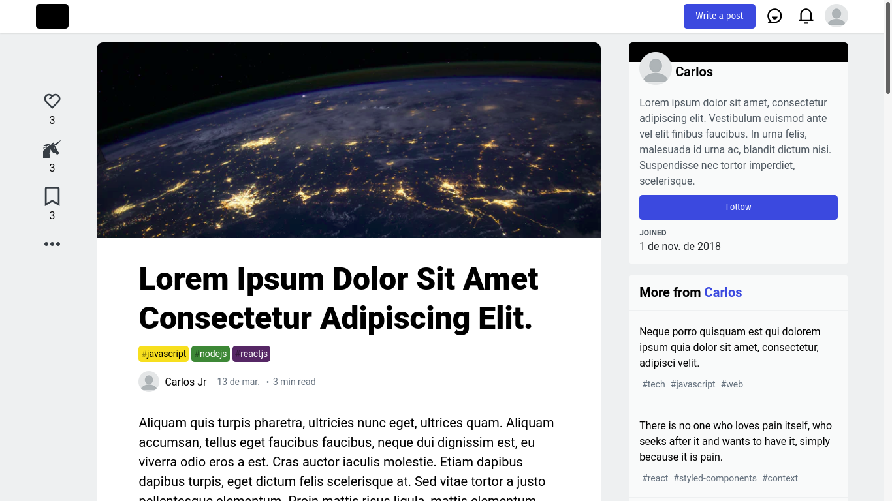

# blog-post-react


## This project is a frontend clone of page Post of the [dev.to](https://dev.to)
## Learning Reactjs


### Prerequisites

Install the requisites:
[Git](https://git-scm.com), [Yarn](https://yarnpkg.com/).

Clone and run the [BackEnd](https://github.com/cjuniordev/login-authenticate-node)

### Getting started

``` bash
# Clone this repository
$ git clone <https://github.com/cjuniordev/blog-post-react>

# Access the project folder
$ cd blog-post-react

# install dependencies
$ yarn install

# serve with hot reload at localhost:3000
$ yarn start
```
